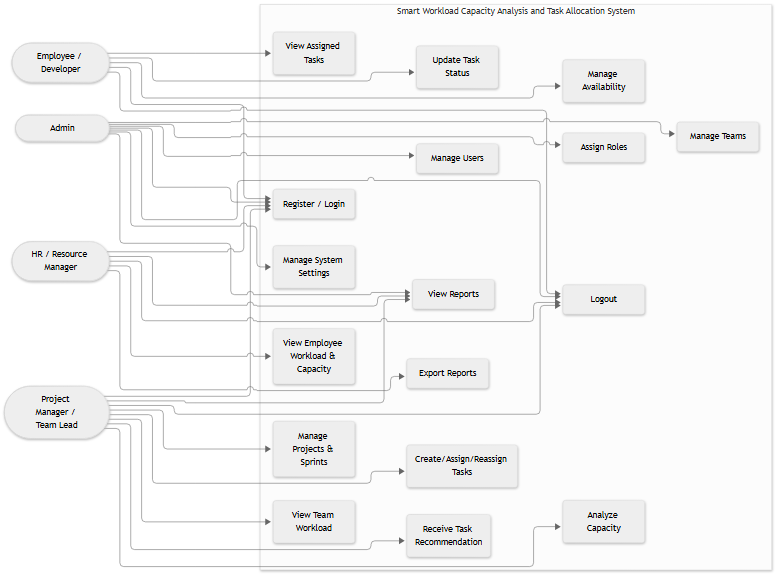
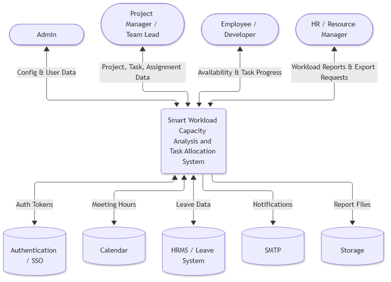
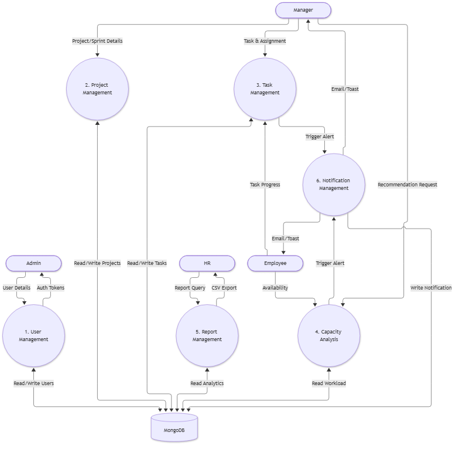
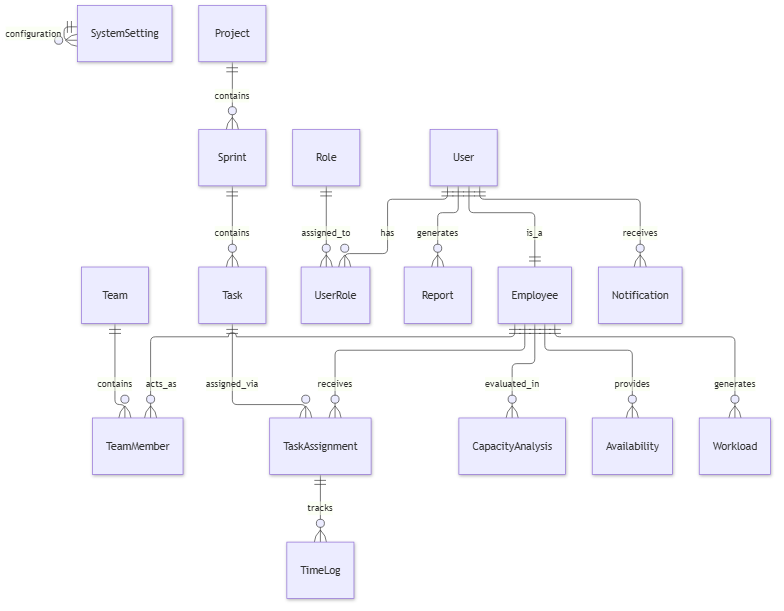
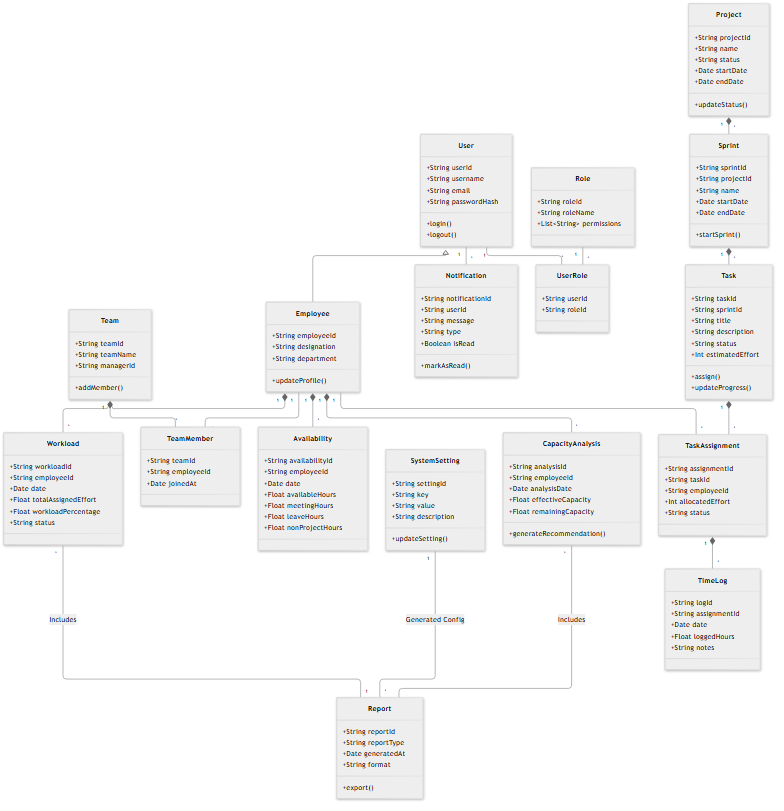
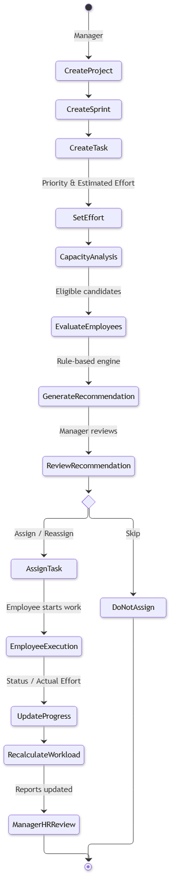
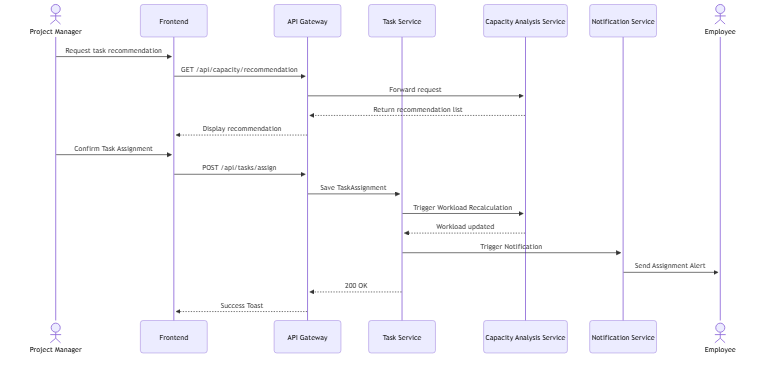
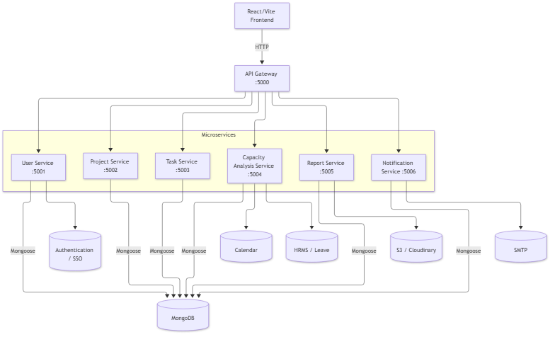
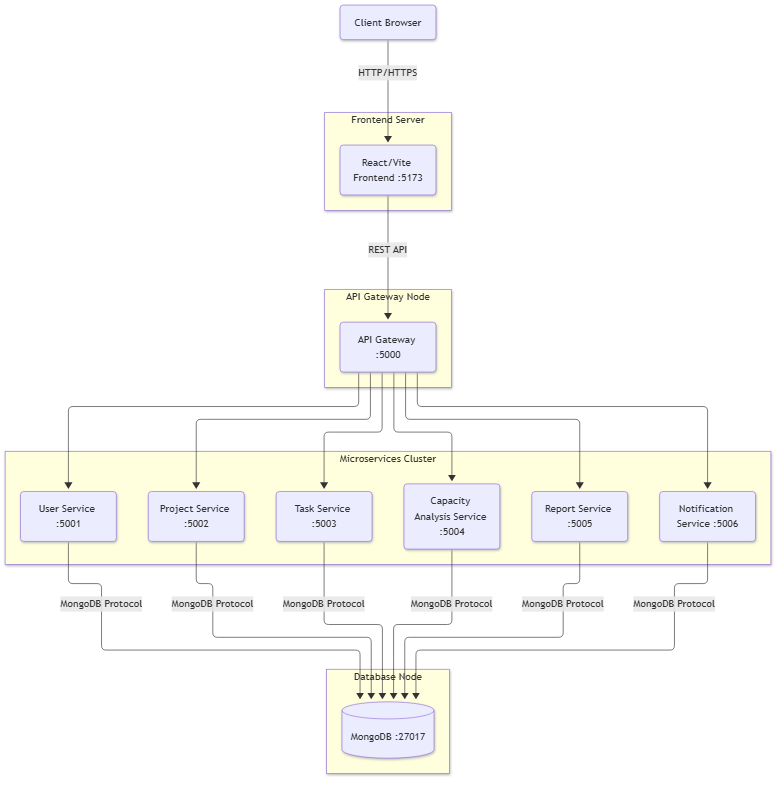

# Software Requirements Specification
## for
# Smart Workload Capacity Analysis and Task Allocation System

**Version 1.0**

**Prepared by:** Harshid Ramprakash
**Institution:** [Insert Institution Name]
**Department:** [Insert Department Name]
**Project Guide:** [Insert Project Guide Name]
**Date:** 27 September 2026

---

## Revision History

| Name | Date | Reason for Changes | Version |
| :--- | :--- | :--- | :--- |
| Harshid Ramprakash | Sept 27, 2026 | Initial Release | 1.0 |

---

## Table of Contents

1. INTRODUCTION
   1.1 Purpose
   1.2 Document Conventions
   1.3 Intended Audience and Reading Suggestions
   1.4 Product Scope
   1.5 References
2. OVERALL DESCRIPTION
   2.1 Product Perspective
   2.2 Product Functions
   2.3 User Classes and Characteristics
   2.4 Operating Environment
   2.5 Design and Implementation Constraints
   2.6 User Documentation
   2.7 Assumptions and Dependencies
3. EXTERNAL INTERFACE REQUIREMENTS
   3.1 User Interfaces
   3.2 Hardware Interfaces
   3.3 Software Interfaces
   3.4 Communications Interfaces
4. SYSTEM FEATURES
   4.1 Authentication and User Management
   4.2 Role and Team Management
   4.3 Project and Sprint Management
   4.4 Task Management
   4.5 Employee Availability and Capacity
   4.6 Workload Analysis
   4.7 Rule-Based Task Recommendation
   4.8 Reports and Export
   4.9 Notifications
5. OTHER NONFUNCTIONAL REQUIREMENTS
   5.1 Performance Requirements
   5.2 Safety Requirements
   5.3 Security Requirements
   5.4 Software Quality Attributes
   5.5 Business Rules
6. OTHER REQUIREMENTS
   6.1 Database Requirements
   6.2 Backup and Recovery Requirements
   6.3 Security / Privacy Requirements
   6.4 Future Enhancements
APPENDIX A — GLOSSARY
APPENDIX B — ANALYSIS MODELS
APPENDIX C — TO BE DETERMINED LIST

---

## 1. INTRODUCTION

### 1.1 Purpose
This Software Requirements Specification (SRS) defines the functional and non-functional requirements for the Smart Workload Capacity Analysis and Task Allocation System. It serves as a formal communication document for developers, testers, project managers, HR/resource managers, administrators, and stakeholders to understand the system's verified implementation, architecture, and constraints.

### 1.2 Document Conventions

| Term | Definition |
| :--- | :--- |
| SRS | Software Requirements Specification |
| UI | User Interface |
| API | Application Programming Interface |
| REST | Representational State Transfer |
| JWT | JSON Web Token |
| DB | Database |
| MongoDB | The NoSQL database used for persistent storage |
| CRUD | Create, Read, Update, Delete |
| RBAC | Role-Based Access Control |
| API Gateway | The entry point for all client requests that proxies to microservices |
| Microservice | An independent, deployable service responsible for a specific domain |
| KPI | Key Performance Indicator |
| Capacity | Total potential working hours available |
| Effective Capacity | Working hours minus meetings, leave, and non-project activities |
| Remaining Capacity | Effective capacity minus existing task commitments |
| Workload | The percentage of effective capacity consumed by assigned tasks |
| Utilization | Overall measurement of how much capacity is being used |
| HRMS | Human Resources Management System |
| SSO | Single Sign-On |

### 1.3 Intended Audience and Reading Suggestions
This document is intended for:
- **Project Supervisor:** To evaluate the academic implementation against the requirements.
- **Developers:** To understand the microservices architecture, API contracts, and business logic.
- **Testers:** To develop end-to-end and functional test cases based on defined requirements.
- **Project Managers & HR:** To understand the workload capacity workflows and reporting features.

### 1.4 Product Scope
The Smart Workload Capacity Analysis and Task Allocation System analyzes employee workload and available capacity. It supports task allocation using existing commitments, availability, meetings, leave, non-project activities, estimated effort, and workload classification. 

The main objectives are to:
- Improve workload visibility for managers and HR.
- Avoid employee overload through dynamic utilization tracking.
- Support balanced task allocation with a rule-based task allocation recommendation engine.
- Assist managers in assignment decisions.
- Provide workload and capacity reports.

*Note: The system identifies workload and capacity conditions to support manager decision-making. The Manager/Team Lead makes the final assignment decision.*

### 1.5 References
- IEEE Std 830-1998, Recommended Practice for Software Requirements Specifications.
- Pressman, R. S. (2014). *Software Engineering: A Practitioner's Approach*. McGraw-Hill Education.
- Project Source Code and Architecture Documentation.

---

## 2. OVERALL DESCRIPTION

### 2.1 Product Perspective
This is a web-based, role-based workload management platform built using a microservices architecture. It replaces manual workload tracking with a centralized, data-driven system.

The system consists of a React Single Page Application (SPA) frontend that communicates with a Node.js API Gateway. The Gateway routes requests to six independent backend microservices, which persist data in a MongoDB database and integrate with external adapters.

Architecture Flow:
`Frontend -> API Gateway -> Microservices (User, Project, Task, Capacity, Report, Notification) -> MongoDB / Adapters`

### 2.2 Product Functions
- User registration and login.
- Role-based authentication and authorization.
- User, Role, and Team management.
- Project creation and management.
- Sprint management.
- Task creation, editing, and status tracking.
- Task assignment and reassignment workflow.
- Employee availability management.
- Capacity calculation (Effective and Remaining).
- Workload classification.
- Rule-based task allocation recommendation.
- Generation of Workload and Capacity utilization reports (CSV generation).
- Notifications (Toast and Email adapter).

### 2.3 User Classes and Characteristics

#### 2.3.1 Admin
- **Responsibilities:** Manages overall system configuration, users, roles, and global teams.
- **Permissions:** Full access to all administrative routes, user CRUD, and system settings.
- **Typical Usage:** Initial system setup, adding new employees, and managing organizational squads.

#### 2.3.2 Project Manager / Team Lead
- **Responsibilities:** Manages software projects, plans sprints, creates tasks, analyzes capacity, and assigns tasks to developers.
- **Permissions:** Access to project, sprint, and task management. Can trigger the capacity recommendation engine and view team workload reports.
- **Typical Usage:** Daily task assignment, sprint planning, and monitoring team burnout risks.

#### 2.3.3 Employee / Developer
- **Responsibilities:** Executes assigned tasks, updates task progress/actual effort, and manages personal availability.
- **Permissions:** Access to personal task queue and availability forms. Cannot reassign tasks to others.
- **Typical Usage:** Logging daily progress, updating remaining task hours, and reporting upcoming leave/meetings.

#### 2.3.4 HR / Resource Manager
- **Responsibilities:** Monitors organization-wide workforce health and capacity drain.
- **Permissions:** Access to HR dashboards and aggregate capacity/workload reporting routes.
- **Typical Usage:** Generating CSV exports of employee utilization and identifying overloaded departments.

### 2.4 Operating Environment

| Component | Technology |
| :--- | :--- |
| Operating System | Windows 10/11 or compatible development OS |
| Frontend | React, Vite, HTML/CSS/JavaScript |
| Backend | Node.js, Express.js |
| Database | MongoDB (via Mongoose) |
| Architecture | Microservices |
| API Gateway | Node.js/Express gateway |
| Browser | Google Chrome / Microsoft Edge / Firefox |
| Development IDE | Visual Studio Code / compatible IDE |

### 2.5 Design and Implementation Constraints
- **Microservices Architecture:** The backend must remain decoupled across independent services.
- **Authorization:** All API endpoints (except public authentication routes) require valid JWTs.
- **Database:** MongoDB is the sole database technology for this implementation.
- **Recommendation Logic:** The capacity recommendation engine must remain rule-based.
- **Environment Context:** External integrations (SMTP, S3, Calendar, HRMS) operate in mock/local adapter modes for academic demonstration.
- **Configuration:** Environment variables are used for port and database configurations.

### 2.6 User Documentation
- Software Requirements Specification (this document).
- Root repository `README.md` (Installation and Setup documentation).
- API Service documentation (via codebase comments and postman collections if exported).

### 2.7 Assumptions and Dependencies
- MongoDB is available and running on the configured URI.
- The API Gateway and all backend services are actively running.
- The frontend development server or production build is running.
- Users have valid credentials to authenticate.
- Projects and sprints exist before tasks are created.
- Employees have submitted availability data for capacity analysis.
- External adapters may operate in mock/local mode during demonstration.

---

## 3. EXTERNAL INTERFACE REQUIREMENTS

### 3.1 User Interfaces
The system features a React-based frontend designed for desktop use. Key interfaces include:
- Login and Registration screens.
- Role-specific dashboards (Admin, Manager, Employee, HR).
- Persistent sidebar navigation and contextual breadcrumbs.
- Forms with required field indicators and standardized inputs.
- Responsive data tables for Projects, Sprints, and Tasks.
- Visual capacity indicators and workload status badges.
- Modals for workflow execution and confirmations.
- Toast notifications for system feedback.

### 3.2 Hardware Interfaces
The system requires standard hardware:
- Desktop or laptop computer.
- Keyboard and mouse/trackpad.
- Standard display monitor.
- Active network connection.

### 3.3 Software Interfaces

| Interface | Description |
| :--- | :--- |
| React & Vite | Frontend SPA framework and build tool |
| Node.js & Express | Backend runtime and routing framework |
| MongoDB | Persistent document database |
| API Gateway | Reverse proxy routing client requests to microservices |
| SMTP Adapter | Interfaces with external email servers (mock/local) |
| Calendar Adapter | Interfaces with scheduling tools (mock/local) |
| HRMS Adapter | Interfaces with HR leave systems (mock/local) |
| Storage Adapter | Interfaces with Cloudinary/S3 for files (mock/local) |
| Browser | Standard HTML5 compliant web browser |

### 3.4 Communications Interfaces
- **Client-to-Gateway:** HTTP/REST communication over standard web ports.
- **Gateway-to-Service:** HTTP proxying to internal microservice ports.
- **Data Exchange Format:** JSON payloads and responses.
- **API Routes:** The Gateway exposes structured routes including `/api/users/*`, `/api/projects/*`, `/api/tasks/*`, `/api/capacity/*`, `/api/reports/*`, and `/api/notifications/*`.

---

## 4. SYSTEM FEATURES

### 4.1 Authentication and User Management
**4.1.1 Description and Priority**
Allows users to securely register, log in, and access role-restricted areas of the system. (Priority: High)

**4.1.2 Stimulus/Response Sequences**
- *Action:* User submits valid login credentials.
- *Response:* System validates credentials, issues a signed JWT, and grants dashboard access.

**4.1.3 Functional Requirements**
**REQ-001: User Authentication**
- **Description:** The system shall allow users to authenticate using an email and password.
- **Inputs / Preconditions:** Email and password credentials
- **Processing / Business Logic:** Validate credentials and verify user status
- **Expected Output / Postconditions:** Signed JWT and user role details

**REQ-002: JWT Generation**
- **Description:** The system shall generate and return a signed JWT upon successful authentication.
- **Inputs / Preconditions:** Valid user credentials
- **Processing / Business Logic:** Sign JWT with secret key containing user ID and role
- **Expected Output / Postconditions:** Signed JWT token string

**REQ-003: Role-Based Route Restriction**
- **Description:** The system shall restrict protected API routes based on the authenticated user's role.
- **Inputs / Preconditions:** HTTP request with JWT
- **Processing / Business Logic:** Verify JWT and check if user role is authorized for the endpoint
- **Expected Output / Postconditions:** HTTP 200 OK if authorized, otherwise HTTP 403/401 Error

### 4.2 Role and Team Management
**4.2.1 Description and Priority**
Allows Administrators to manage the workforce structure. (Priority: Medium)

**4.2.2 Stimulus/Response Sequences**
- *Action:* Admin assigns an employee to an engineering squad (Team).
- *Response:* System updates the TeamMember records in the database.

**4.2.3 Functional Requirements**
**REQ-004: User CRUD Operations**
- **Description:** The system shall allow Administrators to create, read, update, and delete user accounts.
- **Inputs / Preconditions:** Admin input data for user account
- **Processing / Business Logic:** Perform CRUD operation on User and Employee collections
- **Expected Output / Postconditions:** Updated database record and confirmation response

**REQ-005: Role Assignment**
- **Description:** The system shall allow Administrators to assign and modify user roles.
- **Inputs / Preconditions:** Admin input specifying user and role
- **Processing / Business Logic:** Update UserRole record in database
- **Expected Output / Postconditions:** Updated role assignment

**REQ-006: Team and Member Management**
- **Description:** The system shall allow Administrators to create Teams and assign Employees to them.
- **Inputs / Preconditions:** Team details and employee selections
- **Processing / Business Logic:** Create Team and TeamMember records
- **Expected Output / Postconditions:** New team structure saved in database

### 4.3 Project and Sprint Management
**4.3.1 Description and Priority**
Allows Managers to structure work into projects and time-boxed sprints. (Priority: High)

**4.3.2 Stimulus/Response Sequences**
- *Action:* Manager creates a new sprint with start and end dates.
- *Response:* System creates the sprint and links it to the parent project.

**4.3.3 Functional Requirements**
**REQ-007: Project Management**
- **Description:** The system shall allow Project Managers to create and edit projects.
- **Inputs / Preconditions:** Project details (name, description, dates)
- **Processing / Business Logic:** Create/Update Project record
- **Expected Output / Postconditions:** Saved Project entity

**REQ-008: Sprint Management**
- **Description:** The system shall allow Project Managers to create sprints linked to a specific project.
- **Inputs / Preconditions:** Sprint timeline and parent project ID
- **Processing / Business Logic:** Create Sprint record linked to Project
- **Expected Output / Postconditions:** Saved Sprint entity

### 4.4 Task Management
**4.4.1 Description and Priority**
Allows Managers to define work items and Employees to update progress. (Priority: High)

**4.4.2 Stimulus/Response Sequences**
- *Action:* Manager assigns a task to an employee.
- *Response:* System records the TaskAssignment and triggers workload recalculation.

**4.4.3 Functional Requirements**
**REQ-009: Task Creation**
- **Description:** The system shall allow Project Managers to create tasks with priority and estimated effort.
- **Inputs / Preconditions:** Task details including effort and priority
- **Processing / Business Logic:** Create Task record linked to sprint/project
- **Expected Output / Postconditions:** Saved Task entity

**REQ-010: Task Assignment and Reassignment**
- **Description:** The system shall allow Project Managers to assign and reassign tasks to Employees.
- **Inputs / Preconditions:** Task ID and Employee ID
- **Processing / Business Logic:** Create/Update TaskAssignment record and trigger capacity recalculation
- **Expected Output / Postconditions:** Task assigned to employee, workload recalculated

**REQ-011: Personal Task Viewing**
- **Description:** The system shall allow Employees to view their assigned tasks.
- **Inputs / Preconditions:** Employee JWT
- **Processing / Business Logic:** Query TaskAssignments for authenticated employee
- **Expected Output / Postconditions:** List of assigned tasks

**REQ-012: Task Progress Updates**
- **Description:** The system shall allow Employees to update the status, progress, and actual effort of their assigned tasks.
- **Inputs / Preconditions:** Task progress details
- **Processing / Business Logic:** Update Task and TaskAssignment, recalculate capacity
- **Expected Output / Postconditions:** Updated task status and workload

### 4.5 Employee Availability and Capacity
**4.5.1 Description and Priority**
Allows the tracking of meetings and leave for capacity calculation. (Priority: High)

**4.5.2 Stimulus/Response Sequences**
- *Action:* Employee records 2 hours of leave.
- *Response:* System stores the availability record for the specific date.

**4.5.3 Functional Requirements**
**REQ-013: Availability Logging**
- **Description:** The system shall allow Employees to log daily availability including meeting hours, leave hours, and non-project hours.
- **Inputs / Preconditions:** Availability details for a specific date
- **Processing / Business Logic:** Store Availability record for employee
- **Expected Output / Postconditions:** Saved availability log

### 4.6 Workload Analysis
**4.6.1 Description and Priority**
Calculates real-time availability and workload thresholds based on stored data. (Priority: High)

**4.6.2 Stimulus/Response Sequences**
- *Action:* A new task assignment is saved.
- *Response:* System recalculates the employee's workload percentage based on their effective capacity.

**4.6.3 Functional Requirements**
**REQ-014: Effective Capacity Calculation**
- **Description:** The system shall calculate Effective Capacity as: Max(0, Available Hours - Meeting Hours - Leave Hours - Non-Project Hours).
- **Inputs / Preconditions:** Employee availability data
- **Processing / Business Logic:** Apply effective capacity formula ensuring non-negative result
- **Expected Output / Postconditions:** Calculated Effective Capacity (hours)

**REQ-015: Remaining Capacity Calculation**
- **Description:** The system shall calculate Remaining Capacity as: Max(0, Effective Capacity - Assigned Task Effort).
- **Inputs / Preconditions:** Effective capacity and sum of assigned active task efforts
- **Processing / Business Logic:** Apply remaining capacity formula ensuring non-negative result
- **Expected Output / Postconditions:** Calculated Remaining Capacity (hours)

**REQ-016: Workload Percentage Calculation**
- **Description:** The system shall calculate Workload Percentage as (Assigned Effort / Effective Capacity) * 100.
- **Inputs / Preconditions:** Assigned effort and effective capacity
- **Processing / Business Logic:** Apply workload percentage formula (handle zero capacity gracefully)
- **Expected Output / Postconditions:** Calculated Workload Percentage (%)

**REQ-017: Workload Classification**
- **Description:** The system shall classify workload based on configured thresholds (Low <= 60%, Normal <= 80%, High <= 100%, Overloaded > 100%).
- **Inputs / Preconditions:** Calculated workload percentage
- **Processing / Business Logic:** Evaluate percentage against static thresholds
- **Expected Output / Postconditions:** Workload status string (Low, Normal, High, Overloaded)

### 4.7 Rule-Based Task Recommendation
**4.7.1 Description and Priority**
Provides data-driven suggestions for task assignments based on capacity rules. (Priority: High)

**4.7.2 Stimulus/Response Sequences**
- *Action:* Manager requests a recommendation for a 5-hour task.
- *Response:* System evaluates eligible employees using workload rules and returns a recommendation.

**4.7.3 Functional Requirements**
**REQ-018: Rule-Based Recommendation Engine**
- **Description:** The system shall provide a rule-based task allocation recommendation engine.
- **Inputs / Preconditions:** Task effort estimation
- **Processing / Business Logic:** Analyze all team members capacities and workloads
- **Expected Output / Postconditions:** Ranked list of recommended employees

**REQ-019: Recommendation Filtering**
- **Description:** The system shall evaluate eligible employees and filter those where Remaining Capacity >= Task Effort.
- **Inputs / Preconditions:** Task effort and employee capacities
- **Processing / Business Logic:** Filter out employees lacking sufficient remaining capacity
- **Expected Output / Postconditions:** Filtered list of eligible candidates

**REQ-020: Recommendation Ranking**
- **Description:** The system shall rank suitable candidates prioritizing those with the lowest projected Workload Percentage.
- **Inputs / Preconditions:** Filtered eligible candidates
- **Processing / Business Logic:** Calculate projected workload if task assigned, sort ascending
- **Expected Output / Postconditions:** Sorted list of recommended candidates

### 4.8 Reports and Export
**4.8.1 Description and Priority**
Provides capacity and workload analytics for HR and Managers. (Priority: Medium)

**4.8.2 Stimulus/Response Sequences**
- *Action:* HR Manager requests a capacity report export.
- *Response:* System generates a CSV file and provides a download link.

**4.8.3 Functional Requirements**
**REQ-021: Organization Reports**
- **Description:** The system shall generate organization-wide Workload and Capacity utilization reports, including Employee workload, Team workload, Capacity analysis, and Historical workload data. The report UI distinguishes historical workload data from current employee workload data.
- **Inputs / Preconditions:** Report parameters (type, scope)
- **Processing / Business Logic:** Aggregate capacity and workload data across all active employees
- **Expected Output / Postconditions:** JSON report data structure

**REQ-022: CSV Report Export**
- **Description:** The system shall allow authorized roles to export generated reports in CSV format.
- **Inputs / Preconditions:** JSON report data
- **Processing / Business Logic:** Convert JSON data to CSV format and store via Storage Adapter
- **Expected Output / Postconditions:** Downloadable CSV file URL

### 4.9 Notifications
**4.9.1 Description and Priority**
Generates alerts for key workflow events. (Priority: Low)

**4.9.2 Stimulus/Response Sequences**
- *Action:* Manager assigns a task to an Employee.
- *Response:* System generates a notification record for the Employee.

**4.9.3 Functional Requirements**
**REQ-023: Workflow Notifications**
- **Description:** The system shall generate notifications when tasks are assigned or reassigned.
- **Inputs / Preconditions:** Task assignment event
- **Processing / Business Logic:** Create Notification record and trigger email adapter
- **Expected Output / Postconditions:** Stored notification and dispatched email

---

## 5. OTHER NONFUNCTIONAL REQUIREMENTS

### 5.1 Performance Requirements
- NFR-001: The system should aim to load dashboard views within 2 seconds under normal conditions.
- NFR-002: The API Gateway should proxy requests to microservices with minimal latency overhead.
- NFR-003: The rule-based recommendation engine should process team evaluations and return results within 3 seconds.

*(Note: These are qualitative targets for the academic implementation; rigorous load testing was not formally baselined.)*

### 5.2 Safety Requirements
- NFR-004: The system shall require confirmation via modal overlay before executing destructive actions (e.g., deleting a team).
- NFR-005: The system shall handle failed microservice calls gracefully by catching exceptions and returning standardized HTTP error codes to the client.

### 5.3 Security Requirements
- NFR-006: The system shall validate JWT tokens on all protected API routes using authentication middleware.
- NFR-007: The system shall rely on environment variables (`.env`) to store configuration secrets outside of tracked version control.

### 5.4 Software Quality Attributes
- **Reliability:** The microservices architecture ensures that a failure in the Notification Service does not prevent the Task Service from functioning.
- **Usability:** The UI shall utilize consistent visual cues (capacity bars, status badges) for immediate workload comprehension.
- **Maintainability:** The codebase separates concerns by isolating business logic into distinct microservices and React components.

### 5.5 Business Rules
- BR-001: Every protected operation shall require authenticated access.
- BR-002: Users shall only access functionality permitted by their assigned role (Admin, Manager, Employee, HR).
- BR-003: Effective capacity shall account for working hours, meetings, leave, and non-project activities.
- BR-004: Remaining capacity shall account for existing task commitments.
- BR-005: Task recommendations shall be based on the implemented rule-based capacity and workload logic.
- BR-006: The Manager/Team Lead shall make the final task assignment decision.
- BR-007: Employees shall only manage their own availability information and update tasks assigned to them.
- BR-008: Overloaded workload conditions (>100% utilization) shall be identifiable by the system across all reporting dashboards.

---

## 6. OTHER REQUIREMENTS

### 6.1 Database Requirements
The system utilizes MongoDB via Mongoose, with data schemas distributed according to service ownership boundaries:
- **User Service:** User, Role, UserRole, Employee, Team, TeamMember, SystemSetting
- **Project Service:** Project, Sprint
- **Task Service:** Task, TaskAssignment, TimeLog
- **Capacity Service:** Availability, Workload, CapacityAnalysis
- **Report Service:** Report
- **Notification Service:** Notification

The data model supports the relational referencing of entities (e.g., ObjectIDs) to maintain referential data structures, coordinated through REST-based inter-service communication where applicable.

### 6.2 Backup and Recovery Requirements
- **Current Implementation:** Operates via local or in-memory MongoDB runtime for academic demonstration.
- **Production Requirement:** Future production deployments must implement automated daily MongoDB snapshots and point-in-time recovery.

### 6.3 Security / Privacy Requirements
- Employee workload and capacity data must only be accessible to authorized Managers, HR, and Admins.
- System secrets (JWT secret keys) must be configured securely via environment variables.

### 6.4 Future Enhancements
The following features are not currently implemented but are recommended for future iterations:
- Production SSO integration.
- Real Google Calendar / Microsoft Outlook API integration.
- Real enterprise HRMS API integration.
- Production SMTP and cloud storage (AWS S3) configuration.
- Real-time WebSocket notifications.
- Containerized Docker/Kubernetes cloud deployment.
- Continuous Integration / Continuous Deployment (CI/CD) pipelines.

---

## APPENDIX A — GLOSSARY

- **API Gateway:** The entry point for all client requests that proxies to microservices.
- **Capacity:** Total potential working hours available.
- **Effective Capacity:** Working hours minus meetings, leave, and non-project activities.
- **HRMS:** Human Resources Management System.
- **JWT:** JSON Web Token used for authentication.
- **Microservice:** An independent, deployable service responsible for a specific domain.
- **MongoDB:** The NoSQL database used for persistent document storage.
- **RBAC:** Role-Based Access Control.
- **Remaining Capacity:** Effective capacity minus existing task commitments.
- **REST:** Representational State Transfer architecture for APIs.
- **Reassignment:** The process of moving an assigned task from one employee to another.
- **Smart Workload Capacity Analysis and Task Allocation System:** The software product specified in this document.
- **Sprint:** A time-boxed period during which specific tasks must be completed.
- **SRS:** Software Requirements Specification.
- **SSO:** Single Sign-On authentication method.
- **Task Assignment:** The linking of an employee to a specific task.
- **Utilization:** Overall measurement of how much capacity is being used.
- **Workload:** The percentage of effective capacity consumed by assigned tasks.

---

## APPENDIX B — ANALYSIS MODELS

**Figure 1: Use Case Diagram**

**Figure 2: Context / Level 0 Data Flow Diagram**

**Figure 3: Level 1 Data Flow Diagram**

**Figure 4: Entity Relationship Diagram**

**Figure 5: Class Diagram**

**Figure 6: Activity Diagram**

**Figure 7: Sequence Diagram**

**Figure 8: Component / Microservices Architecture Diagram**

**Figure 9: Deployment Diagram**

## APPENDIX C — TO BE DETERMINED LIST

| ID | Item | Status |
| :--- | :--- | :--- |
| TBD-001 | Production SSO Integration | Future Enhancement |
| TBD-002 | Real HRMS Leave Sync Integration | Future Enhancement |
| TBD-003 | Real Google Calendar / Outlook API integration | Future Enhancement |
| TBD-004 | WebSockets for Real-time push notifications | Future Enhancement |
| TBD-005 | Containerized Docker deployment strategy | Future Enhancement |
| TBD-006 | CI/CD Pipeline Configuration | Future Enhancement |

---
*End of Document*
